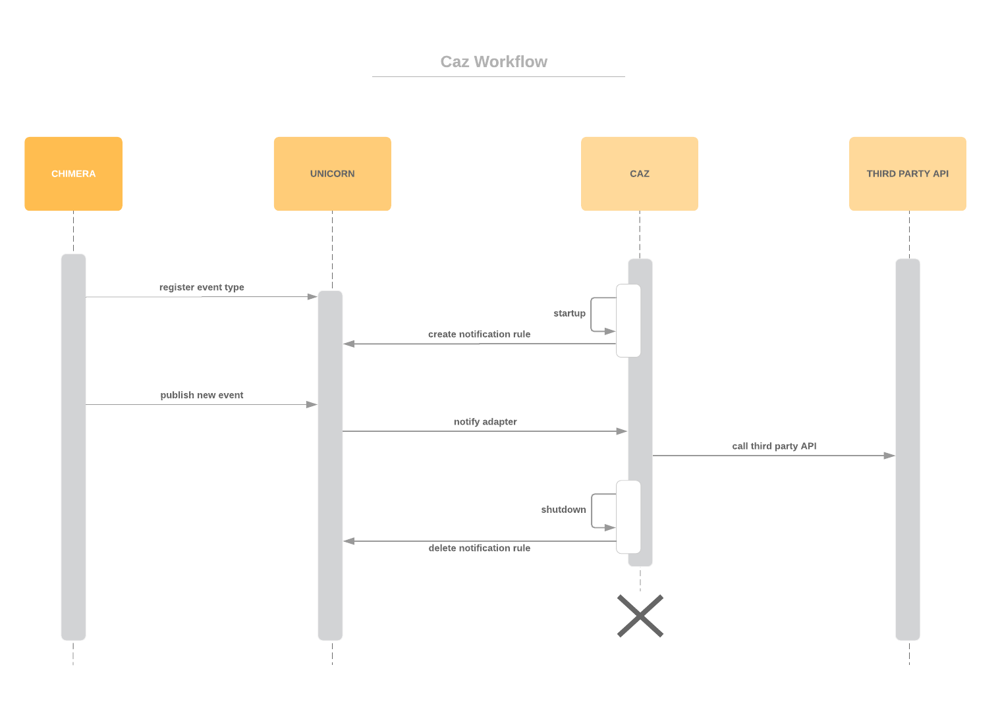

# CAZ
> Generic adapter to subscribe to handle communication between Unicorn and Third Party APIs

<!-- [![NPM Version][npm-image]][npm-url]
[![Build Status][travis-image]][travis-url]
[![Downloads Stats][npm-downloads]][npm-url] -->

Chimera uses events to communicate with third party APIs. In order to make it as easy as possible to establish the connection, CAZ provides a generic, easy to configure, framework.



## Installation

```sh
git clone https://github.com/bptlab/caz.git
cd caz
npm install             # Install dependencies
npm install -g nodemon  # To restart server on filechange for local development
npm run start           # Start server
```

> Note, that in order to work with UNICORN, CAZ must know the UNICORN URL and its own URL. 
You can set the URLs using the environment variables `UNICORN_BASE_URL` and `CAZ_BASE_URL`.
See [Development Section](#development-setup) for an example.

## Usage

The CAZ already provides a simple way to subscribe to Unicorn events.

### Subscribe to events

In order to receive messages it is necessary to first subscribe to all events that are of interest.
Please overwrite the `SUBSCRIPTIONS` constant in `app.js` with an array that contains an object for each subscription.

*An example of a subscription:*

```javascript
const SUBSCRIPTIONS = [{
  event: 'DCParcel',
  attributes: ['*'],
  filters: { 'DO_state': 'delivered' },
  route: '/sis/delivery-reported'
}];
```

CAZ handles registering and also deleting unnecessary subscriptions in Unicorn automatically.

### Handle Notifications

Once an event is generated in Unicorn that matches one or multiple subscriptions CAZ is called with a POST request on the specified route.
The request body contains a JSON object matching the event type that is registered in Unicorn.
The CAZ can now convert the data to a format that is accepted by third party APIs and subsequently call the third party API with the correct data.

*An example of a notification handler:*

```javascript
router.post('/delivery-reported', function (req, res, next) {   // Add route defined by subscription
  const { sscc, receiverID } = req.body;                        // Pick only necessary event information
  const eventXml = epcisEvents.receiving2(sscc, receiverID);    // Convert JSON to XML expected by third party API
  epcisEvents.send(eventXml);                                   // Call third party API with correct data
  next();
}, helpers.sendSuccessfullUnicornResponse);                     // Send success response to Unicorn
```

## SMile

Although the generic architecture of the CAZ can be used for all sorts of projects involving Unicorn as the event engine, this implementation is developed for the Smile Project. 
More details, e.g. the process description can be found in the [Wiki of the Smile Project](https://github.com/bptlab/smile/wiki).
The CAZ acts as an adapter between UNICORN and three external API providers, namely: **Pickshare**, **SIS** and **TMS**.
For the communication from the process engine to the external partner the CAZ subscribes to events of interest, converts the data and calls the third party API.
On the other hand the CAZ offers REST routes for the partners that publish events.

### Pickshare

#### SMile ➡ Pickshare

1. `parcel-registered`
1. `time-slot-offer-created`
1. `delivery-reported`

SMile informs Pickshare when a new parcel is registered, when an offer is created and after the successful delivery.

#### Pickshare ➡ SMile

1. `receiver-preferences-received`
1. `arrived-at-depot`
1. `offer-confirmed`

Pickshare informs SMile about the receivers address and time slot preferences, the arrival at the microdepot and the confirmation of an offer. 

### SIS

#### SMile ➡ SIS

1. `arrived-at-depot`
1. `pickup-reported`
1. `delivery-reported`

SMile informs SIS when the parcel arrived at the depot, when the deliverer picks up the parcel at the depot and when the parcel is delivered to the receiver.

#### SIS ➡ SMile

1. `parcels`

SIS informs SMile about new parcels added by the sender

### TMS

#### TMS ➡ SMile

1. `pick-up-reported` 
1. `delivery-reported`

TMS informs SMile when the deliverer picks up a parcel at the microdepot and when the parcel is delivered to the receiver

## Development setup

To start local development it's enough to run

```sh
npm run start # or
nodemon       # restarts server on filechange
# If you are running the bpt-docker-zoo you can run this command to hook up the CAZ
UNICORN_BASE_URL=http://localhost/smile/unicorn CAZ_BASE_URL=http://host.docker.internal:3000 nodemon
```

## Release History

> Currently no released Version

* 0.0.1
    * Work in progress

## Meta

Marius Lichtblau – [@lichtblau](https://twitter.com/lichtblau) – marius@lichtblau.io

[Github](https://github.com/mlichtblau)

## Contributing

1. Fork it (<https://github.com/bptlab/caz/fork>)
2. Create your feature branch (`git checkout -b feature/fooBar`)
3. Commit your changes (`git commit -am 'Add some fooBar'`)
4. Push to the branch (`git push origin feature/fooBar`)
5. Create a new Pull Request

<!-- Markdown link & img dfn's -->
[npm-image]: https://img.shields.io/npm/v/datadog-metrics.svg?style=flat-square
[npm-url]: https://npmjs.org/package/datadog-metrics
[npm-downloads]: https://img.shields.io/npm/dm/datadog-metrics.svg?style=flat-square
[travis-image]: https://img.shields.io/travis/dbader/node-datadog-metrics/master.svg?style=flat-square
[travis-url]: https://travis-ci.org/dbader/node-datadog-metrics
[wiki]: https://github.com/yourname/yourproject/wiki
